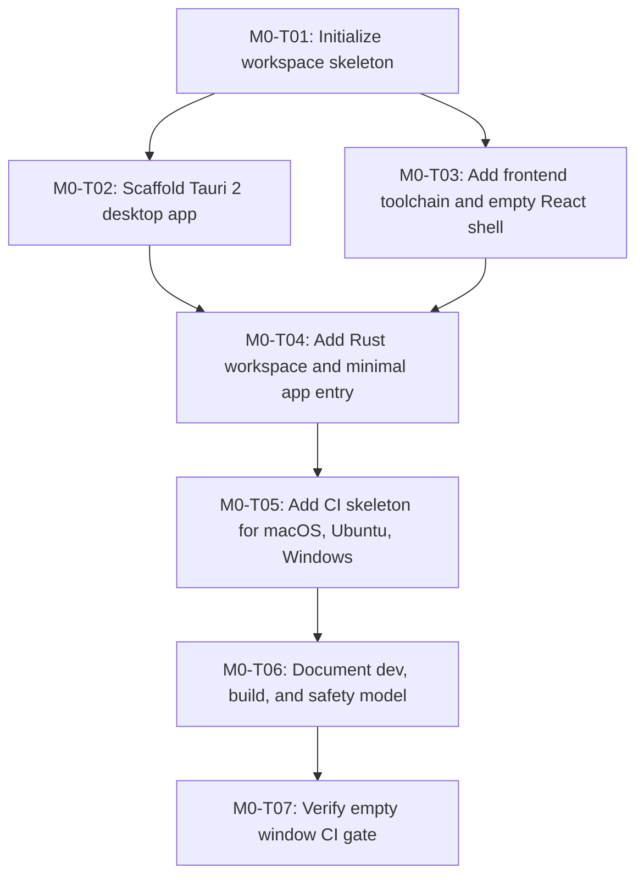

# M0 Task DAG

Milestone goal: Workspace scaffold, Tauri 2 hello-world, CI skeleton.
Exit gate: Empty Tauri window opens on all 3 OSes via CI.

| Task ID | Plan Ref | Scope | Depends On |
|---|---|---|---|
| M0-T01 | plan.md "Repository layout"; plan.md "Milestones" M0 | Create the monorepo directory skeleton, workspace manifests, and baseline ignore/config files without production feature code. | None |
| M0-T02 | plan.md "Stack"; plan.md "Repository layout"; plan.md "Milestones" M0 | Scaffold the Tauri 2 desktop package under `apps/desktop` with minimal config. | M0-T01 |
| M0-T03 | plan.md "Stack"; plan.md "Frontend port rules"; plan.md "Milestones" M0 | Add Vite/React/TypeScript frontend shell that can be hosted by Tauri. | M0-T01 |
| M0-T04 | plan.md "Stack"; plan.md "Backend architecture"; plan.md "Milestones" M0 | Add minimal Rust app entry that opens an empty window and compiles in the workspace. | M0-T02, M0-T03 |
| M0-T05 | plan.md "CI matrix"; plan.md "Milestones" M0 | Add GitHub Actions CI skeleton for macOS, Ubuntu, and Windows. | M0-T04 |
| M0-T06 | plan.md "Safety boundary"; plan.md "Deliverables"; plan.md "Acceptance checklist" | Add README and CHANGELOG foundations documenting install/dev/build/test and simulation-only boundary. | M0-T05 |
| M0-T07 | plan.md "Milestones" M0; prompt.md "Milestone exit gates" | Ensure the CI gate exercises the empty Tauri window/build path across all three OS targets. | M0-T06 |
